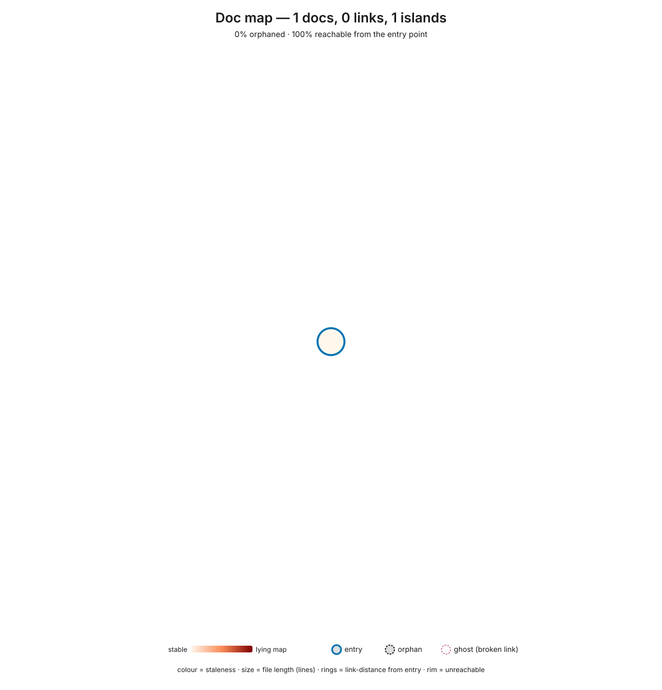

# Codebase Assessment: excalidraw-room-mcp

_Generated 2026-09-08. Generated by `/assess` v1.56.1._

**Score: 4.0 / 8 - Basic** - a readiness snapshot, not a verdict · Keyhole: 3 structural concerns (3 self-referential tests), 0 safe zones.

Two commits in, this repo already has the shape most projects reach after months: strict TypeScript with zero `any`, a 39-line `CLAUDE.md` whose runtime-corrections section names the four things training gets wrong here (stdout is the transport, the relay wants an Origin header, no DOM package in Node, bump version and nonce), coverage measured on every PR, and a stryker run that put real numbers on the tests: 90% of mutants die in `crypto.ts`, 89% in `reconcile.ts`, but only 56% in `elements.ts`, where 199 mutants survived at 97% line coverage. That asymmetry is the one thing to fix next: pin the arrow geometry and summariser in `elements.ts` with assertions that would fail if the numbers were wrong, then make the green checks actually block by protecting `main`.

_Note: Mutation testing was not run. Layer 6 (Coverage) is capped at Partial and truth-pressure remains unproven._

> **Agents start here.** The prioritized Top 3 actions below are also machine-readable in `.assess/actions.json` (schema v2: every entry carries `rank`, `action`, `done_when`, and `scope_fence`, plus the lifecycle fields `status` / `claimed_by` / `completed_sha` and a derived execution `mode`). Read that file to pick up the work - even with a smaller model - without parsing this report's prose.

## Top 3 Actions

Actions 1 and 2 cover the three attention paths (`src/crypto.ts`, `src/reconcile.ts`, `src/elements.ts`, all flagged self-referential because code and tests landed in one commit); Action 3 closes the Layer 3/4/5 gap where the repo's conventions are prose and its green checks do not block.

| # | Action | Layer | Effort | Command / First Step | Done when | Scope fence | Hotspot files this addresses | Issue |
|---|--------|-------|--------|---------------------|-----------|-------------|------------------------------|-------|
| 1 | Human-review the known-answer tests in `src/interop.test.ts` against upstream: confirm the fixture (`tests/fixtures/scene-from-excalidraw-com.json`, written by excalidraw.com, not this server) is the right truth anchor for `src/crypto.ts` and `src/reconcile.ts`, and add one assertion per upstream binding field (`mode`, `fixedPoint`) so a wire-format change fails here first | 6 | small | Open `src/interop.test.ts`; compare its assertions with `excalidraw-app/collab/Portal.tsx` and `packages/excalidraw/data/encryption.ts` upstream | `npm test` passes and the interop test asserts the arrow binding shape upstream writes today (`mode: "orbit"`), not only top-level keys | Only `src/interop.test.ts` and the fixture; no changes to `src/crypto.ts` or `src/reconcile.ts` | `src/crypto.ts`, `src/reconcile.ts` | #3 |
| 2 | Strengthen assertions in `src/elements.test.ts` at the stryker survivors in `buildElements` (fn ccn 67): the arrow edge-point maths (`src/elements.ts:257`, `299-305`, `337-338`) and the summariser (`436-454`) - assert exact coordinates, label placement, and summary strings, characterization-style (pin what it does today) | 6 | medium | `npm run mutate` then open `reports/mutation/mutation.json`, filter `status == "Survived"` for `src/elements.ts` | `npm run mutate` reports `elements.ts` mutation score >= 80% (from 55.6%) with no new `// Stryker disable` comments | Tests only; no refactor of `buildElements` until the characterization tests are in | `src/elements.ts` | #4 |
| 3 | Turn the CLAUDE.md prose contracts into enforced ones: add ESLint flat config with typescript-eslint, `complexity` (15), `no-console` (allow `error`), and `no-restricted-imports` for `@excalidraw/excalidraw`; add `npm run lint` to `.github/workflows/ci.yml`; require the `test` check on `main` via branch protection | 3 | small | `npm i -D eslint typescript-eslint` (current versions on npm), write `eslint.config.js`, then `gh api -X PUT repos/bjcoombs/excalidraw-room-mcp/branches/main/protection` with `required_status_checks.contexts=["test"]` | `npm run lint` runs in CI and passes (with `buildElements` fenced by an explicit `// eslint-disable-next-line complexity` that names Action 2 as the fix), and a PR with a failing `test` check cannot be merged | Config and workflow only; no source edits beyond the one documented disable | `src/elements.ts`, `src/index.ts`, `src/room.ts` | #5 |

### Why these three?

The deterministic core's only finding is that every tested module was written alongside its tests, so the suite may encode the author's model rather than Excalidraw's. Action 1 answers that with the strongest available truth: a scene excalidraw.com encrypted itself, decrypted by this code, and a human confirming the fixture is the right anchor. Action 2 targets the file where the truth gap is measured rather than suspected: 97% of lines run under test, 44% of mutants survive, so the arrow geometry could be subtly wrong and nothing would go red. Action 3 stops the drift the CLAUDE.md warns about from happening silently: today `console.log` in server code or an accidental DOM import passes CI, and CI itself does not block a merge.

## Snapshots

### Complexity - riskiest to change

Risk concentrates in one function: `buildElements` in `src/elements.ts` (fn ccn 67, a per-spec `switch` with dozens of `??` defaults); every other function in the repo is under 15.

### Doc navigability - can an agent find its way?

Two docs, both entry points, neither linking the other: 100% reachable, no orphans, no lying maps; a wayfinding nicety (README pointing at CLAUDE.md) rather than a gap.

📈 Snapshot detail (commit, hotspots, navigability, lying maps)

#### Complexity profile

- **Measured at commit:** `fd6461b63f55` (2026-09-08) - **working tree had uncommitted changes; figures include un-committed edits** (this run's staged tests, CLAUDE.md, CI changes, and stryker config)
- **Files scored:** 19 (12 via lizard, 7 via scc)
- **Churn window chosen:** all-time (activity below thresholds in every window; every file has one commit, so the churn axis is inactive and the treemap renders pure complexity)
- **Complexity profile:** file-aggregate ccn p95 91 (max 141); p95 est. tokens 2,918 (max 4,111); p95 LOC 264 (max 408). Per-function: worst function ccn 67 (`buildElements`), next worst 13 (`src/room.ts`)
- **Top hotspots** (composite `sqrt(ccn) × sqrt(1 + commits) × sqrt(est_tokens)` - a sub-linear blend of complexity, recent churn, and context-window size, so a file high on *multiple* axes - big AND complex AND churning - is the worst keyhole and leads; a frozen-but-complex file ranks below an equally-sized active one; a churny-but-trivial file can't top on churn alone; and a big-but-simple-stable file can't top on size alone). `est_tokens` is the char-based estimate (~chars/4), `ccn` here is the **file aggregate**; the worst single function per file is in parentheses:
  1. `src/elements.ts` - 4,111 est. tokens (408 LOC), aggregate ccn 141 (worst function 67), 1 commit in window
  2. `src/room.ts` - 2,786 est. tokens (248 LOC), aggregate ccn 86 (worst function 13), 1 commit in window
  3. `src/index.ts` - 2,473 est. tokens (218 LOC), aggregate ccn 21 (worst function 6), 1 commit in window
  4. `src/elements.test.ts` - 1,439 est. tokens (120 LOC), aggregate ccn 33 (worst function 5), 1 commit in window
  5. `src/reconcile.ts` - 506 est. tokens (55 LOC), aggregate ccn 17 (worst function 9), 1 commit in window

- **Keyhole budget** (`stats_summary.est_tokens.budget`): the repo is ~19,059 est. tokens in total; 0 files and 0 subtrees exceed the ~200k keyhole budget. The whole codebase fits one context window roughly ten times over.

Size encodes estimated tokens (~chars/4 - the keyhole size unit; the familiar LOC is one hover away in the tooltip), colour encodes cyclomatic complexity (dark red = high), saturation encodes recent git churn (vivid = active). Tokens track what fills an agent's context window better than LOC, which undercounts dense/wide files and overcounts sparse code. Vivid red blocks are the migration risk. When the treemap carries a **hatched** overlay (only when opt-in mutation results exist), those blocks are covered-but-unpinned code - tests run them without constraining them - so they stop reading as safe green; the heatmap's own legend keys the diagonal (>30% survivor density) and cross-hatch (>50%, severe).

No hatching visible - mutation analysis was not run. The hatching would mark covered-but-unpinned code (tests that execute without constraining). Run `/assess` and accept the mutation offer to enable it.

Caveat on that line: the offer *was* accepted in this run, but the core's opt-in pass has no stryker runner for TypeScript and produced an empty block, so the treemap carries no overlay. Stryker 10 was run by hand instead (`stryker.config.json`, `npm run mutate`); its numbers appear under Layer 6 and Action 2. Had the overlay rendered, `src/elements.ts` would carry the diagonal hatch (44% survivor density).

#### Where to focus testing

Coverage data: `coverage/lcov.info` (lcov, Node's built-in coverage; it lists only files the unit tests load, so `src/index.ts` and `src/e2e.ts` are absent from it rather than reported at 0%).

| File | Risk | Test Signal | Suggested Action |
|------|------|-------------|------------------|
| `src/elements.ts` | High | Unknown (no coverage) | Add tests |
| `src/room.ts` | High | Unknown (no coverage) | Add tests |
| `src/index.ts` | High | Unknown (no coverage) | Add tests |
| `src/elements.test.ts` | Medium | Unknown (no coverage) | Add tests |
| `src/reconcile.ts` | Medium | Unknown (no coverage) | Add tests |
| `src/firebase.ts` | Medium | Unknown (no coverage) | Add tests |
| `src/e2e.ts` | Medium | Unknown (no coverage) | Add tests |
| `src/crypto.ts` | Low | Unknown (no coverage) | Add tests |

Read the Test Signal column with the measured figures beside it: the core did not credit the sibling `*.test.ts` files or the lcov report, so it reports every file as unknown. Measured line coverage is `crypto.ts` 100%, `elements.ts` 97%, `firebase.ts` 100%, `reconcile.ts` 100%, `room.ts` 38% (link parsing and status only; socket, broadcast and persist paths run only in the manual e2e driver), `index.ts` none. The rows that deserve the "Add tests" label are `src/room.ts` and `src/index.ts`; `src/elements.ts` needs "Strengthen assertions" (see Action 2).

#### Doc navigability

Of 2 docs, 100% are reachable and none are orphans, but they form 2 islands: `README.md` and `CLAUDE.md` do not link to each other. Both are entry points a reader would open directly, so this is a curation nicety (a one-line pointer from README to CLAUDE.md), not a blocker. No broken links, no excluded raw-source trees.

**Lying maps (stale docs of churning code).** Stale = days since the doc itself last changed; subject churn = commits in the window to the code the doc describes; centrality = how many other docs point to it. The core lists `README.md` (0 days stale, subject churn 10, ratio 10.0, high confidence) and `CLAUDE.md` (not yet committed, repo-baseline, low confidence) as hubs. Neither is a lying map: a document changed today cannot be stale, and the ratio is an artefact of a two-commit history where every code file counts as churn. Ignore both until the repo has enough history for the ratio to mean something.

Colour = staleness (vivid red = a frozen doc beside churning code = a lying map); structure = reachability (centre = entry, rim = unreachable, dashed ring = orphan); size = file length. Hover a node in the SVG (opened on its own) for its path and stats.

#### What changed since last run

_No prior run to compare against - this is the first recorded snapshot._ (The core rotated a sidecar from an earlier pass in this same session, which is why `log.md` shows a diff of one graduated and one new test file; that is intra-run noise, not a trend.)

📊 Full scorecard (per-layer evidence & gaps)

The two headline metrics measure **different things and are never combined.** The 0-8 score answers _"is the scaffolding in place to catch problems?"_ (a property of the contracts and enforcement layers). The Keyhole Readiness summary answers _"where is today's structural pain?"_ - a pure count of structural concerns and safe zones rolled up from the ten cross-layer findings. A repo can score 7/8 and still carry many structural concerns (great scaffolding over churning legacy), or 3/8 with zero concerns (small, calm codebase). Report both side by side in the headline; never average, rescale, or fold one into the other.

The **What it asks** column is the question that layer answers for an agent working here - read it first; the framework name is secondary. The **Band** orders them by dependency: a read-side blind spot makes the write-side scores mean less (you can't trust enforcement of a picture you can't see), and the meta band only matters once the rest works.

| Layer | What it asks | Band | Status | Evidence | Gap |
|-------|--------------|------|--------|----------|-----|
| 0: Agent Instructions & Navigability | Can I build a true map of this codebase before I touch it? | read | Present | `CLAUDE.md` grades B+ (8 positive directives, 14 path references, 2 trade-off phrases), 39 lines, no broken references, no sensitive content. Its "Runtime corrections" section names the stdout-is-transport, Origin-header, no-DOM-import and version/nonce rules. README covers install, tools, protocol and limits. Doc graph: 2 docs, 100% reachable, 0 orphans. | README and CLAUDE.md do not link each other (2 islands). 0 verifiable-outcome phrases in CLAUDE.md ("done when" style). |
| 1: Runtime Legibility / Liveness | Can I see which parts are live, which need attention, and which are dead weight? | read | Missing | Observability rung 0: no telemetry, no runbook, no agent-reachable log path. `ts-prune` ran with 0 dead-export candidates (intra-repo only). With no deployed runtime, liveness is read through complexity, churn and reachability, not telemetry; the only live probe is the manual e2e driver against a real room. | A runbook naming the e2e driver, the `EXCALIDRAW_ROOM_DEBUG` flag, and how to read a relay handshake failure (400 websocket / 403 polling means the Origin header is missing) would reach rung 2; a repo skill that runs the e2e reaches rung 3. |
| 2: Code Design | Will the type-checker catch my mistakes? | write | Present | `tsconfig.json` `strict: true`; 0 `any`, 0 `@ts-ignore`; 13 exported types/interfaces across 5 modules; `readonly` inputs in reconcile, elements and firebase; `bump()` returns a copy instead of mutating. | None material at this size. |
| 3: Linters | Are complexity and style bounds enforced, or will my code drift? | write | Missing | No eslint, biome or prettier config; `tsc` is the only static check. `buildElements` in `src/elements.ts` has fn ccn 67 against a conventional 15; per-function p95 is 7.9 so it is the single offender. 0 promissory markers. | ESLint flat config with `complexity`, `no-console` (allow `error`), `no-restricted-imports` (`@excalidraw/excalidraw`), wired into CI (Action 3). |
| 4: Architecture Tests | Are the structural conventions executable, or just folklore? | write | Missing | No architecture or convention tests. Two CLAUDE.md rules ("never `console.log` in server code", "do not import `@excalidraw/excalidraw`") are prose only. | The two lint rules in Action 3 make both executable; a third could assert every `src/*.ts` except `index.ts` and `e2e.ts` has a sibling test. |
| 5: CI Pipeline | Does something automatically catch a bad change before it merges? | write | Partial | `.github/workflows/ci.yml`: build + unit tests + lcov summary on push to main, PR and dispatch; a separate stryker job on main and dispatch (not a PR gate, by design). CodeRabbit reviews PRs. 0 disabled-test markers. | No branch protection (`gh api .../branches/main/protection` returns 404), so a red check does not block merge. No lint step. No coverage threshold. |
| 6: Coverage Gates | Do the tests constrain behaviour, or just execute lines? | write | Partial - truth-pressure unproven (mutation not run) | Coverage measured on every PR (lcov via Node): crypto 100%, elements 97%, firebase 100% (fetch stubbed), reconcile 100%, room 38%, index absent. Hand-run stryker 10: overall 62.1% (343 killed / 210 survived / 1 timeout); crypto 90.0%, reconcile 89.4%, elements 55.6% with survivors clustered on arrow geometry (lines 257, 299-305, 337-338) and the summariser (436-454); dominant survived mutators ConditionalExpression 48, StringLiteral 36, ArithmeticOperator 35, LogicalOperator 27. The interop test decrypts a scene excalidraw.com wrote and checks builder field-sets against it. | Coverage is reported, never gated. `src/index.ts` (the MCP tool surface) has no automated test. `src/room.ts` socket, broadcast and persist paths are e2e-only. The core's mutation pass has no TypeScript runner, so the cap stands until the toolkit consumes a stryker report. |
| 7: Code Review Bots | Is there design-level feedback on every change? | write | Present | CodeRabbit is active: 5 actionable comments on PR #1 (duplicate ids, NaN arrow endpoint, unconditional Firestore write, mutable id, duplicate ids in commit), all addressed before merge. | No committed `.coderabbit.yaml`; reviewer behaviour lives in the app, not the repo. |
| 8: AI Project Mgmt (capstone) | Do learnings feed back into the contracts, or evaporate? | meta | Missing | Tracked `.claude/settings.json` (20 allow, 2 deny on `.env` reads). No hooks, routines, task orchestration, or retro artefacts; 2 commits, so no repeated cycle to judge. 0 TODO markers. | A `/assess` re-run recorded in `.assess/log.md` after Action 2 lands would be the first feedback cycle; a hook that runs `npm test` before commit would be the first encoded routine. |

**Archetype-aware Status (`N/A` ≠ `Missing`).** This is a software repo (heuristic code-file ratio 0.86); all nine layers apply, denominator 8.

**Layer 1 evidence carries an explicit caveat by default.** Layer 1 scores what the repo makes agent-reachable, not what the agent has installed at runtime; no rung-3 claim is made here.

### Score derivation (worked)

Present = 1, Partial = 0.5, Missing = 0, capped at 8.

L0 Present (1) + L1 Missing (0) + L2 Present (1) + L3 Missing (0) + L4 Missing (0) + L5 Partial (0.5) + L6 Partial (0.5) + L7 Present (1) + L8 Missing (0) = **4.0 raw**, under the cap, so the displayed score is **4.0 / 8**.

### Maturity Level

| Score | Level | Description |
|-------|-------|-------------|
| 0-2 | Not Ready | Agent will produce inconsistent, unvalidated code |
| 3-4 | Basic | Norms exist but aren't enforced. Agent works but drifts |
| 5-6 | Solid | Contracts catch most issues. Agent is productive |
| 7-8 | AI-Native | System self-improves. Agents work reliably at scale |

4.0 falls in **Basic**: the norms are written down (CLAUDE.md, strict TypeScript, coverage on every PR) but nothing yet stops a change that breaks them from merging.

### What this score unlocks

The maturity band bounds how much agent **autonomy** this repo's contracts can safely absorb, in the vocabulary of the adoption ladder ([Steps of AI Adoption](https://www.threads.com/@boris_cherny/post/Da4CkQnEea-), B. Cherny, 2026): the per-step guardrails Cherny names are these layers (self-verification loops = L5/L6, automated review = L7, agent instructions = L0, encoded routines and permissions = L8).

| Band | Contracts support up to | Why |
|------|------------------------|-----|
| Not Ready | Step 1 (Assisted) - one supervised agent | No verification contracts; a human must review every change |
| Basic | Step 1-2 boundary | Parallel agents are risky until L5/L6 self-verification holds |
| Solid | Step 2 (Parallel) - ~10 agents, one orchestrator | Self-verification and review automation absorb parallel diffs |
| AI-Native | Step 3 (Supervised autonomy) - background routines | Contracts plus L8 orchestration can absorb autonomous loops |

**This is a bound, not a claim about how the team actually works.** At Basic, one supervised agent per PR with a human reading the diff is the safe mode; Action 3 (branch protection plus lint) is what moves the bound to Solid.

🔎 Cross-layer findings & lying signals (keyhole detail)

### Lying Signals

| Layer | Signal Type | Instance | Why it lies |
|-------|-------------|----------|-------------|
| 6 | Green-but-hollow | `src/elements.ts` (coverage 97% vs mutation 55.6%) | Tests execute the file (green coverage) but don't constrain it (199 mutants survive, mostly in the arrow edge-point maths and the summariser) - the gate says "tested" while behaviour is unpinned |

No stale-hub row: the only hubs are 0 days old (README) or uncommitted (CLAUDE.md), so their churn ratios are history artefacts, not staleness. No dead-but-present row: `ts-prune` found 0 candidates. The Layer 6 row comes from the hand-run stryker report, not the core's `test_pressure` block, which is empty.

## Cross-Layer Findings (Keyhole Readiness)

The three flagged files are the three pure modules that have unit tests at all; the finding fires because each landed in the same commit as its tests, so the suite could be checking the author's model rather than Excalidraw's behaviour. `src/interop.test.ts` (added in this run) is the partial answer: it decrypts a scene excalidraw.com wrote, compares builder field-sets against real elements, and checks upstream's fractional indices against `orderByIndex`. What remains is the human review the finding asks for (Action 1) and pinning the survivors in `elements.ts` (Action 2).

### self_referential_tests

Action: request human review - tests verify internal consistency, not truth

Paths:
- src/crypto.ts
- src/elements.ts
- src/reconcile.ts

### Attention List (Priority Order)

- src/crypto.ts (score 1): self_referential_tests
- src/elements.ts (score 1): self_referential_tests
- src/reconcile.ts (score 1): self_referential_tests

✅ Strengths & further opportunities

### Strengths

- **Runtime corrections are written where an agent will read them.** `CLAUDE.md` names the four ways this code differs from what training predicts (stdout is the protocol channel, the relay demands `Origin: https://excalidraw.com`, `@excalidraw/excalidraw` cannot load in Node, every mutation must bump `version` and `versionNonce`), each traceable to a real failure met while building it.
- **The crypto and merge logic are checked against the real thing, not just themselves.** `tests/fixtures/scene-from-excalidraw-com.json` is a Firestore document the web app wrote; `src/interop.test.ts` decrypts it, checks the field-sets the app emits are a subset of what the builders produce (which is how `strokeOptions` and `labelPosition` were discovered), and checks upstream's fractional indices are already in `orderByIndex` order.
- **Two modules have measured truth-pressure above 89%.** `crypto.ts` (90.0%) and `reconcile.ts` (89.4%) kill nearly every mutant; the round-trip and tie-break rules are pinned.
- **Review feedback was acted on, not waved through.** CodeRabbit's five findings on PR #1 (including the unconditional Firestore write) each became a code change with a test.
- **Types do real work.** Strict mode, zero `any`, `readonly` on every input array, and a `bump()` that returns a copy: the class of bug where a stale element object is broadcast is hard to write.

### Additional Opportunities

- Add a README line pointing at `CLAUDE.md` so the two docs form one island.
- Test `src/index.ts` through the MCP SDK client in-process (spawn `dist/index.js` over stdio, call `room_status` before joining, assert the "not in a room" text) so the tool surface has one automated check.
- Record the e2e driver's expected output in `docs/runbook.md` (what a good join looks like, what a 400/403 handshake means) to move Layer 1 from rung 0 to 2.
- Emit upstream's current arrow binding shape (`mode: "orbit"`, `fixedPoint`) instead of the legacy `focus`/`gap` form the app normalises; the fixture shows what the app converts it to.
- `src/room.ts` is under every cap (worst function ccn 13, 248 LOC) but carries the socket, merge, and persist logic in one class; annotate-first (a header comment naming the three concerns) rather than split.
- Commit a `.coderabbit.yaml` so review behaviour is versioned with the code.

🧭 How to read this report (framing & method)

**What this is ultimately measuring.** When you hand work to an AI here, does it behave like a brand-new hire or like an engineer who has been in the org eighteen months? The difference isn't capability - it's *externalized context*: knowing where things live, which contracts are load-bearing, where the minefields are. An AI contributor is structurally always the new hire - it starts every session with an empty head, seeing one narrow slice through its context window - so this report scores how much of the tenured engineer's implicit map the codebase has made explicit and navigable. The aim is not an AI that comprehends what humans no longer can and is trusted blindly (that is the dangerous case); it is a codebase legible enough that the relevant slice fits one context window and the agent's answers stay anchored to code you can still verify. **Legibility you can trust, not omniscience you can't.** The same ethic points at the write side: when a contributor makes a mistake, the useful question is what made it possible and what would make it impossible next time - so the write-side layers below (linters, architecture tests, CI gates, coverage, review automation) read not as a leash on the agent but as the guardrails that protect any contributor, human or AI, from costly mistakes by design. A **Missing** there means the codebase asks the contributor to be careful where it could instead make the wrong move hard to make.

This is an improvement roadmap, not a verdict. It measures one thing: **is the codebase kept honest, not just scaffolded.** It pairs three views:

- **Where the codebase is today** - the complexity heatmap shows current complexity and churn. Vivid red = complex AND actively changing = the files most likely to bite an agent (or a human) next week.
- **Whether an agent can navigate it** - the doc graph shows the docs' link structure: how much is reachable from the entry point, and which docs are stale maps of churning code.
- **What keeps it from getting worse** - the AI Readiness score (0-8) across three bands: read-side foundation (can the agent form a true picture?), write-side enforcement (can it be trusted to produce good output?), and meta (does the system keep itself honest over time?).

A codebase can be 8/8 and still on fire (great scaffolding, legacy debt) - or 2/8 with a calm treemap (small codebase, no enforcement needed yet). The views matter together.

**Each layer is a sense the agent needs, not a box to tick - and this report is written to be understood without prior knowledge of the framework.** Every row in the scorecard names one thing an agent (or a newly-arrived human) must be able to *see or trust* before working safely here; it's phrased as the question that row answers. A **Missing** or **Partial** is not a mark against the codebase - it locates where someone working here is partly blind, and the Gap column says what would restore the view. One row matters most for cold readers, because it's the one most often misread: **Layer 1 (Runtime Legibility) is the agent's attention-sense - "which parts are actually live, which need attention, which are dead weight creating support burden?"** A running service answers that through telemetry (latency, errors, traffic); a repo with no deployed runtime answers it through complexity, churn, and reachability - so the complexity heatmap and the dead-code scan *are* its observability. A low telemetry score on such a repo means *look through those instruments instead*, *not* "the agent is flying blind." Observability, in this report, is whatever lets the agent see where to point effort - by whichever instrument fits the codebase.

**The legacy-transition lens - this is not a new problem.** The hard part of AI-assisted coding is the same one the industry has faced for 25 years: *what happens when the people who understood the code are gone, or the code outruns anyone's ability to understand it?* AI only changes the **velocity** - a codebase can now slide from modern to legacy in months rather than years, because agents can generate change faster than a team can keep comprehending it. So read this report through the accumulated discipline of legacy-code engineering, not as a novel AI concern. The grounded references below are deliberate: a reading agent already knows them, and they carry weight that "we think you should add tests" does not.

- **"Legacy code is code without tests."** - Michael Feathers, *Working Effectively with Legacy Code* (2004). A file that is **complex, churning, and untested is already legacy**, regardless of its age. The correct response is to write **characterization tests** (pin the code's *actual current behaviour*, since that is what callers depend on - not its intended spec) and find a **seam** (a place to change behaviour without editing the code) to get it under test, *then* refactor.
- **Don't rewrite - strangle.** The instinct under AI velocity is to throw a confusing module away and regenerate it. That is the oldest trap in the book (Joel Spolsky, *Things You Should Never Do*, 2000): a rewrite discards the undocumented behaviour and bug-fixes a working system has accreted. Prefer Martin Fowler's **Strangler Fig** - replace incrementally around the edges, behind tests. An agent's default ("regenerate from intent") is precisely the wrong move; say so where a hotspot invites it.
- **Hotspots and change-coupling are the map.** The complexity-×-churn heatmap and the coupling findings in this report *are* Adam Tornhill's (CodeScene) hotspot and change-coupling analyses - the modern, version-control-aware form of legacy comprehension. Treat the vivid-red hotspots and the `hidden_coupling` seams as the prioritized worklist, not trivia.
- **Decide per component (the 7 Rs).** Not every flagged unit should be refactored: retain, retire, rehost, replatform, refactor, re-architect, or rebuild. Dead weight → *retire*; complex-and-live → *characterize then refactor*; safe `refactor_boundary` zones → hand to an agent in isolation.

When you write the findings and Top 3 Actions, name these anchors where they apply - they tell a reading agent *how to think* about the situation, not just what the metric says.

**How it's measured.** This is an AI-readiness review run almost entirely on *traditional* tooling - static analysis, git history, and graph metrics over the docs and code. The model only writes the prose around those numbers; it does no scanning itself. That keeps a full run fast and close to zero in model tokens, and makes the structural findings reproducible run-to-run.

🤖 Machine-readable data (for agents)

If you are an agent working in this repo, the `.assess/` directory is actionable feedback written for you - the first place to look when deciding where to point effort. It is a compounding, AI-readable record that an agent can ingest directly, without re-parsing this prose, and it grows with every run:

- `.assess/assess-report.md` - this report: the scorecard, the lying signals, and the Top 3 Actions with exact commands and file paths.
- `.assess/run-context.json` - the full data bus (findings, attention, keyhole summary, prescribed actions, stats, diff).
- `.assess/complexity-stats.json` - complexity / estimated-token / LOC percentiles, the keyhole-budget rollup (`est_tokens.budget`), plus the ranked file lists (`top_hotspots`, `top_complex`, `top_large`).
- `.assess/hotspots/<file>.md` - per-file briefings, each with a **Suggested actions** section. Read a file's briefing before you change it.
- `.assess/index.md` - the catalog of every hotspot ever flagged (current and graduated), so you can see what has and hasn't been addressed.
- `.assess/log.md` - append-only run history, so a hotspot's trajectory (regressing / persistent / improving) is visible across runs.

---

_Report generated by [`/ai-native-toolkit:assess`](https://github.com/bjcoombs/ai-native-toolkit). Install in any Claude Code session: `/plugin marketplace add https://github.com/bjcoombs/ai-native-toolkit` then `/plugin install ai-native-toolkit@ai-native-toolkit`._
